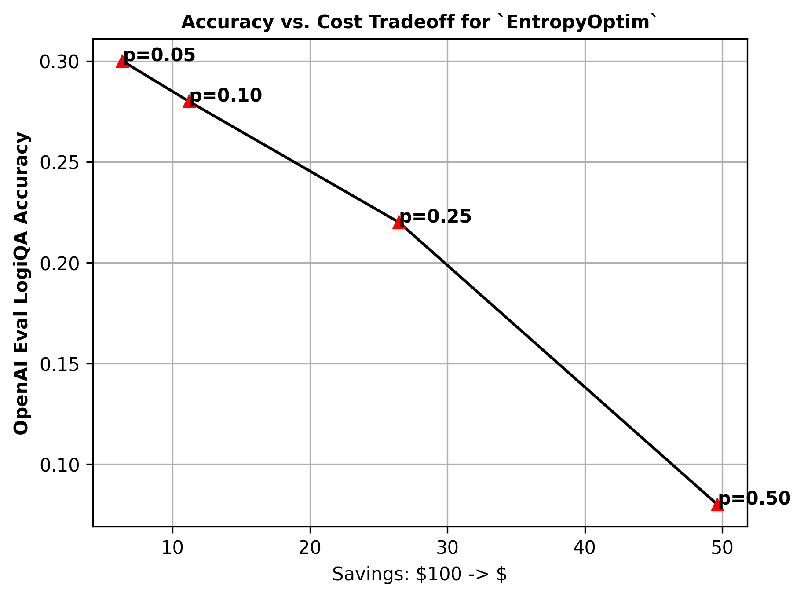

# PromptOptimizer


PromptOptimizer — библиотека для уменьшения токеновой сложности промптов и оценки компромисса между стоимостью и качеством. Она объединяет несколько оптимизаторов и метрики, которые помогают подобрать подходящий способ сжатия под задачу.

## ✨ Особенности
- Содержит несколько оптимизаторов, которые можно применять по отдельности или последовательно.
- Поддерживает защищённые теги для неизменяемых частей промпта.
- Показывает, насколько уменьшилось число токенов и как изменилась семантическая близость.
- Подходит для работы с обычным текстом, LangChain-цепочками и JSON-запросами.
- Содержит папки с примерами, оценками и тестами.

## 🚀 Быстрый старт
### Требования
- Python 3.8.1+

### Установка из исходников
```bash
pip install -e .
```

### Минимальный пример
```python
from prompt_optimizer.poptim import EntropyOptim

prompt = "The Belle Tout Lighthouse is a decommissioned lighthouse and British landmark located at Beachy Head, East Sussex, close to the town of Eastbourne."
p_optimizer = EntropyOptim(verbose=True, p=0.1)
optimized_prompt = p_optimizer(prompt)
print(optimized_prompt)
```

## 📁 Структура проекта
- `prompt_optimizer` — основные оптимизаторы и библиотечная логика.
- `examples` — готовые примеры использования библиотеки.
- `evaluations` — артефакты и графики для сравнения качества и экономии.
- `tests` — автотесты и проверка поведения оптимизаторов.
- `pyproject.toml` — зависимости Poetry и регистрация CLI-команды `prompt-optimizer`.

## 🛠 Использование
### Работа с библиотекой
Базовый сценарий — выбрать подходящий оптимизатор, передать ему строку-промпт и затем сравнить исходный и оптимизированный текст по числу токенов и качеству ответа.

### График компромисса


## 🧪 Технологии
- Python
- Transformers
- PyTorch
- NLTK
- PuLP
- tiktoken

---
Автор: legenda_god  
Telegram: https://t.me/FitoDomik
